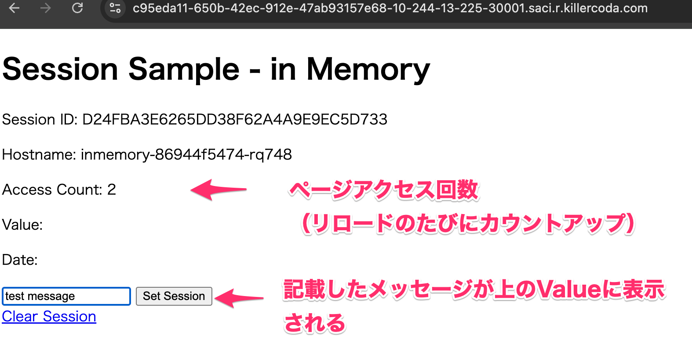
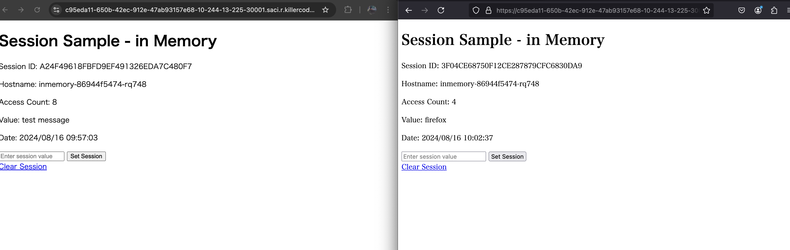
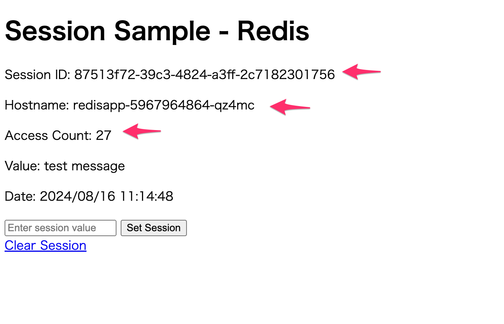

# 複数インスタンス環境でのSession管理

セッション管理が必要なアプリはそのまま複数インスタンスで稼働させてしまうと、セッションを保持していないインスタンスにアクセスしてしまい、正常な動作が行えません（ログインしたのにログアウト状態となる、カートに入れた商品が消えてしまうなどなど）

対策としては以下２パターン考えられますが、おすすめは２番のセッション情報を外部DBに保持する方法です

参考：https://12factor.net/ja/processes

1. セッション情報を保持ているインスタンスにアクセスが行くようにスティッキーセッション（Session Affinity）を設定する
   * メリット
     * アプリへの変更が不要で、いちばん簡単な方法
   * デメリット
     * 特定のインスタンスに依存してしまっている（ステートレスな環境ではない）
     * インスタンスが異常終了した場合にセッションが消えてしまいます
     * セッションがあるインスタンスにアクセスが行ってしまい、複数インスタンス運用していても、負荷が分散されずらい
2. セッション管理を外部DBに保持するようにアプリを書き換える
   * メリット
     * インスタンスが終了してしまった場合もセッション情報が保持される
     * どのインスタンスにアクセスがあっても同様の処理が行える
     * 複数インスタンスで負荷を分散できる
   * デメリット
     * アプリ側に実装をいれる必要がある


それでは実際にそれぞれの挙動を確認してみましょう

## Labの流れ
1. InMemory版のアプリを１Podで起動させ正常な動作を確認
2. InMemory版のアプリをReplicas 3 にしてセッション情報が消えてしまうところを体験
3. Session Affinityを利用したアプリの実行
4. Redis版のアプリを１Pod＋Redisで起動させ正常な動作を確認
5. Redis版のアプリをReplicas 3にして正常に動作することを体験

## 0. サンプルコードの取得
  ```
  git clone https://github.com/kota661/lab-session-affinity.git
  ```


## 1. InMemory版のアプリを１Podで起動させ正常な動作を確認

1. まずは１Podでデプロイし、正常な動作を確認しましょう

   ```
   kubectl apply -f webapp-in-memory.yaml
   ```
   
   

2. アプリにアクセスし正常な動作を確認してみましょう  

	> 補足
	>
	> **killercodaをご利用の場合 (NodePortでのサービス公開)**
	>
	> 1. `kubectl get service inmemory`を実行し、NodePortのPortを確認します。
	>
	> 2. killercodaの画面にて、メニュー＞Trafficを開き、Custom PortsにNode PortのPortを指定しアプリにアクセス、表示されることを確認します。
	>
	> 詳細な方法はLab1を参照してください。
	>
	> **IKSをご利用の場合 -  (Ingressでのサービス公開)**
	>
	> //TODO
	
	

  * Session IDがリロードしても同じIDとなっており、セッション情報が保持されています

  * Hostnameが常に同じ（１Podしか無いので当然ですが、、）

  * ページにアクセスするたびにカウントアップされます

  * テキストを記載しSet SessionをクリックするとValueに表示されます

    

3. 別のブラウザで同じページにアクセスすると別のセッションが開始されます。そしてそのブラウザでもカウントアップやValueが保持されます。

  


> 補足:  
>
> セッション情報はInMemoryに保管されているためアプリが再作成された場合はセッション情報が消えてしまいます。
>
> アプリを再作成する場合は以下の手順を実行してみてください
>
> $ kubectl delete -f webapp-in-memory.yaml
>
> $ kubectl apply -f webapp-in-memory.yaml


## 2. InMemory版のアプリをReplicas 3 にしてセッション情報が消えてしまうところを体験

次に、replicasの数を３に変更し、複数Podでアプリを動かしてみましょう

1. webapp-in-memory.yamlの書き換え

   ```
   # 変更前
   
   spec:
     replicas: 1 # 3
     selector:
       matchLabels:
         app: inmemory
   
   # 変更後
   
   spec:
     replicas: 3
     selector:
       matchLabels:
         app: inmemory
   
   ```

   

2. webapp-in-memory.yamlを適用する

```
$ kubectl apply -f webapp-in-memory.yaml


$ kubectl get pod
NAME                        READY   STATUS              RESTARTS   AGE
inmemory-86944f5474-plsxj   1/1     Running             0          3s
inmemory-86944f5474-ptgvw   0/1     ContainerCreating   0          3s
inmemory-86944f5474-rq748   1/1     Running             0          12m
```


3. それでは実際にアプリにアクセスしてみましょう。アプリが表示されたら何度かリロードしてみてください

   確認事項

   * ３つのPodでアプリを稼働させており、何も設定していないため、リロードを行うことで別のHostname（Pod）が表示されてしまう

   * Session情報を保持していないPodにアクセスがされてしまうためSession IDが変わってしまう（そのためAccess CountやValueも消えてしまいます）


## 3. Session Affinityを利用したアプリの実行

複数Podで運用した場合でも前回アクセスした同じPodにアクセスが行くようにしてみましょう

1. webapp-in-memory.yamlを書き換えます（sessionAffinity: ClientIPのコメントアウトを外します）

   ```
   # 変更前
   
   apiVersion: v1
   kind: Service
   metadata:
     labels:
       app: inmemory
     name: inmemory
   spec:
   	...
     selector:
       app: inmemory
     type: NodePort
     # sessionAffinity: ClientIP 
   
   
   # 変更後
   
   apiVersion: v1
   kind: Service
   metadata:
     labels:
       app: inmemory
     name: inmemory
   spec:
   	...
     selector:
       app: inmemory
     type: NodePort
     sessionAffinity: ClientIP 
   
   ```

   

2. webapp-in-memory.yamlを適用する

3. アプリにアクセスし、何度かリロードを繰り返し、hostnameやAccess Count を見て同一のPodにアクセスしており、セッション情報が保持できていることを確認してください

	> 補足1
	>
	> **killercodaをご利用の場合 (NodePortでのサービス公開)**
	>
	> 1. `kubectl get service inmemory`を実行し、NodePortのPortを確認します。
	>
	> 2. killercodaの画面にて、メニュー＞Trafficを開き、Custom PortsにNode PortのPortを指定しアプリにアクセス、表示されることを確認します。
	>
	> 詳細な方法はLab1を参照してください。
	>
	> **IKSをご利用の場合 -  (Ingressでのサービス公開)**
	>
	> //TODO
	>
	> 
	
	> 補足2
	>
	> NodePortを利用したService公開を行っているため、今回はClientIPを利用したスティッキー・セッションの設定を行っています。Ingressを利用したService公開ではCookieベースでのスティッキー・セッションの設定が行えます


## 4. Redis版のアプリを１Pod＋Redisで起動させ正常な動作を確認

1. まずはRedisをKubernetesにデプロイしましょう

   ```
   $ kubectl apply -f redis.yaml
   
   deployment.apps/redis created
   service/redis created
   
   
   $ kubectl get -f redis.yaml
   
   NAME                    READY   UP-TO-DATE   AVAILABLE   AGE
   deployment.apps/redis   1/1     1            1           47s
   
   NAME            TYPE        CLUSTER-IP     EXTERNAL-IP   PORT(S)    AGE
   service/redis   ClusterIP   10.99.204.63   <none>        6379/TCP   47s
   
   ```

   > 補足情報
   >
   > RedisをClusterIP TypeにてServiceで公開しているため、同じNamespace内のPodからはServiceの名前 redis をHostnameとしてRedisにアクセスすることができます

2. セッション情報の管理にRedisを利用するWebアプリをデプロイしましょう

   ```
   $ kubectl apply -f webapp-redis.yaml
   
   deployment.apps/redisapp created
   service/redisapp created
   
   
   $ kubectl get -f webapp-redis.yaml
   
   NAME                       READY   UP-TO-DATE   AVAILABLE   AGE
   deployment.apps/redisapp   0/1     1            0           8s
   
   NAME               TYPE       CLUSTER-IP     EXTERNAL-IP   PORT(S)          AGE
   service/redisapp   NodePort   10.105.80.90   <none>        8080:30002/TCP   8s
   ```

   

3. デプロイとサービス作成が完了したので、NodePort（ポート番号　30002）を利用してアプリにアクセスしてみましょう

   > 補足情報
   >
   > セッション情報はRedisに保管されているためInMemoryタイプと異なり、アプリが再作成されても情報は保持されます
   >
   > アプリを再作成する場合は以下の手順を実行してみてください
   >
   > $ kubectl delete -f webapp-redis.yaml
   >
   > $ kubectl apply -f webapp-redis.yaml


## 5. Redis版のアプリをReplicas 3にして正常に動作することを体験

1. それでは最後に、Redis版のアプリのReplicas を３に設定し、複数Podでもセッションが保持されたままアプリが利用できるか確認してみましょう

   webapp-redis.yamlを変更

   ```
   # 変更前
   apiVersion: apps/v1
   kind: Deployment
   metadata:
     labels:
       app: redisapp
     name: redisapp
   spec:
     replicas: 1 # 3
     selector:
       matchLabels:
         app: redisapp
         
     
   # 変更後
   apiVersion: apps/v1
   kind: Deployment
   metadata:
     labels:
       app: redisapp
     name: redisapp
   spec:
     replicas: 3
     selector:
       matchLabels:
         app: redisapp
   ```

   

2. webapp-redis.yamlを適用する

   ```
   $ kubectl apply -f webapp-redis.yaml
   
   controlplane $ kubectl apply -f webapp-redis.yaml 
   deployment.apps/redisapp configured
   
   
   # podのappラベルでフィルターしてPodの状況を確認する
   $ kubectl get pod -l app=redisapp
   
   NAME                        READY   STATUS    RESTARTS   AGE
   redisapp-5967964864-2p2q5   1/1     Running   0          3m23s
   redisapp-5967964864-2p6td   1/1     Running   0          10m
   redisapp-5967964864-qz4mc   1/1     Running   0          3m22s
   
   ```

   

3. アプリにアクセスし、何度かリロードを繰り返し、hostnameが変わること（複数のPodに分散してアクセスしていること）を確認の上、Access CountやSession IDが同一なこと（セッション情報が引き継がれている）を確認しましょう




## 最後に

**Labで作成したK8sリソースを以下のコマンドを削除** します。

```
kubectl delete -f webapp-in-memory.yaml
kubectl delete -f redis.yaml
kubectl delete -f webapp-redis.yaml
```


以上でLabは終了です


